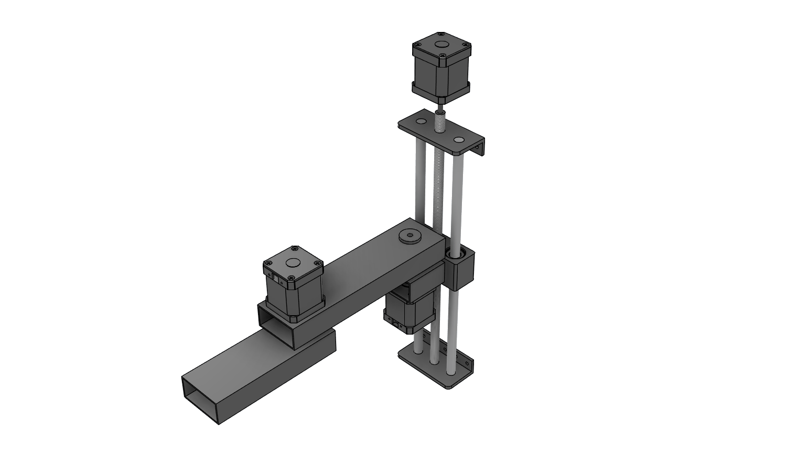

# Scara Arm 

<!-- And/or a video. For the documentation is necesary to have a logo.png in the assets folder -->

## Description
The idea of this project is to build a 3DOF Scara Robot, using Nema 17 and steel frames. The goal precision of the machine is 0.03mm. 
This precision is helpful for PCB assembly that is the main goal of this machine.

## Project Builders
If you want to recreate the latest version of the project, we recommend visiting the docs folder and download the user manual file. There you can find all the instructions, recommendations, dependencies, etc., for this project. Alternatively, in the releases section, you can download a ZIP file with all the files, including the user manual for each version.

## Collaborators
If you want to understand how this project works and modify it as your wish, the Wiki could be a good place for you. There, you can find the technical documentation for all the decisions we made, and who knows maybe after that, you'll want to check the issues to solve one or perhaps propose another idea to implement, I'd be happy to make the project our project.
